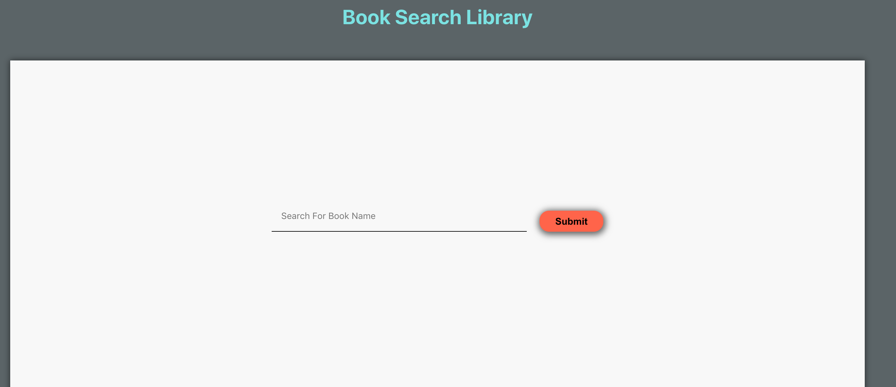

# Book Search Library App

A Simple Book Search Library App using the OpenLibrary External API data.

## Project Screen Shot(s)


## Technical questions
1.	How long did you spend on the coding assignment? 
    8hrs
a.	What would you add to your solution if you had more time?
    - Would show limited data on initial page load and would add an load more button to fetch more books details
b.	If you didn't spend much time on the coding test, then use this as an opportunity to explain what you would add.
    - Would add a Popup Modal, to show more details of the books when user clicks the book. 
2.	What was the most useful feature that was added to the latest version of your chosen language? 
    React Hooks is a really good addition of react, which helps use lot of methods in functional components as well
Please include a snippet of code that shows how you've used it.
Example code of fetching the data from Open Library api call.
```bash
const res = await axios.get(`https://openlibrary.org/search.json?q=${bookName}`);
        this.setState({
          loading: false,
          searchData: res.data.docs
        });
```
3.	How would you track down a performance issue in production? Have you ever had to do this?
    - Check CPU and Memory Usage.
    - We can check the production performance using external services like Lighthouse.
    - i have not done much, but i have experience checking the website using Lighhouse.
4.	How would you improve the API that you just used?
    I have made a api request in a map function, since i had to loop through the data fetched from first api to request cover image of the book using second api. I would try to find a beter way to optimize this code, or find out if there is any other way to fetch all the data from one endpoint. 
5.	Please describe yourself using correctly formatted JSON.
    {
        name: "Keerthikumar",
        age: 29,
        Occupation: "Front End Developer",
        address : {
            Unit: 26,
            line1: "Drew Street",
            city: "Guelph",
            Province: "ON"
        }
    }


## Project setup
Clone down this repository. You will need node and npm installed globally on your machine.

Installation:
```bash
npm install
```

To Start Server:
```bash
npm start
```

To Run Test Suite:
```bash
npm test
```
To Visit App:
```bash
localhost:3000
```